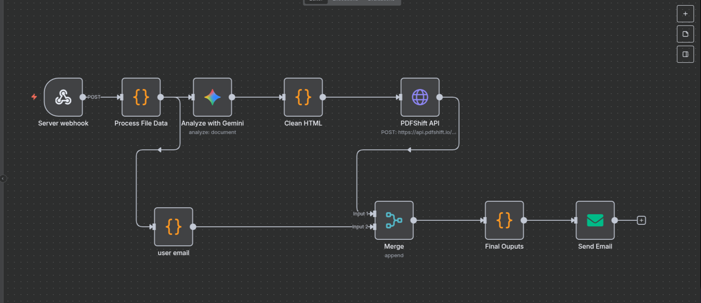

# Assignment Agent: AI-Powered Assistant

A full-stack automation system that **completes assignments on your behalf**.  
Simply upload your work (PDF, DOCX, PPTX), the agent processes it, uses Large Language Models (LLMs) to generate answers, and emails the completed assignment back to you for confirmation—all with minimal manual effort.

### 🌐 Live Demo  
[**AssignAgent**](https://assignment-agent.vercel.app/)  

> ⚠ **Note:** This project uses free-tier hosting for both the frontend and backend, so the server may experience cold starts or temporary downtime.  
If the service seems unresponsive:  
- Try again after a few minutes.  
- Or, for the best experience, **run the project locally** using the instructions in this README.  


## 🌟 What This Project Does

This project automates the process of handling assignments. It:

1.  **Accepts Submissions:** Students upload their work via a simple React frontend.
2.  **Processes Files:** A FastAPI backend extracts text from PDFs, Word docs, and PPTs.
3.  **Runs Workflows with n8n:** n8n orchestrates the pipeline, building a clean HTML structure for answers.
4.  **Leverages AI:** LLMs (Gemini Pro) generate context-aware solutions based on assignment type.
5.  **Delivers Results:** Sends the completed assignment back to the student via email for review/confirmation.
6.  **Scales & Recovers:** Uses Docker for easy deployment and Supabase for reliable workflow state storage.

I built this project to deeply understand and implement cutting-edge "agentic" workflow automation using n8n, exploring how to stitch together various cloud services and APIs into a robust, functional system.

## 🛠️ Tech Stack

- **Workflow Automation:** [n8n](https://n8n.io/)
- **Backend API:** [FastAPI](https://fastapi.tiangolo.com/) (Python)
- **Frontend:** [React](https://reactjs.org/) + [Vite](https://vitejs.dev/)
- **Database:** [Supabase](https://supabase.com/) (PostgreSQL)
- **Containerization:** [Docker](https://www.docker.com/) & [Docker Compose](https://docs.docker.com/compose/)
- **LLM Provider:** Gemini Pro

## 📦 Key Components

- `/frontend` - React application for file uploads. [AI Agent frontend Repository](https://github.com/Srinanth/assignment-agent) 
- `/backend` - FastAPI server for file processing and status updates.
- `docker-compose.yml` - Defines and runs n8n and the backend service.
- `workflows/` - Exported JSON definitions of the core n8n workflows for version control.
- `.env.example` - Template for all required environment variables.

## The N8N Workflow of this project:


## Key Tools in This Project

Here’s a quick overview of the main tools that make this agent possible:

### n8n
An open-source workflow automation tool (like Zapier/Make). It lets you connect APIs and services with drag-and-drop nodes, making it easy to build complex automation without writing tons of code.


### Docker
A platform that packages apps and their dependencies into portable containers, ensuring they run the same everywhere. We use it to run the backend and n8n together reliably.


### Supabase
A hosted PostgreSQL database service. We use it to persist workflow data and application state, so the system is reliable across restarts.


## 🚀 Getting Started

### Prerequisites

- [Docker](https://docs.docker.com/get-docker/)
- [Docker Compose](https://docs.docker.com/compose/install/)
- A Supabase project (for PostgreSQL)
- API keys for Gemini (and an SMTP service for emails gmail is preferd)

### Local Development

1.  **Clone the repository:**
    ```bash
    git clone https://github.com/Srinanth/AI-Agent
    cd assignment-agent
    ```

2.  **Set up Environment Variables:**
    ```bash
    cp .env.example .env
    ```
    Edit the `.env` file with your actual credentials:
    - check out the sample env file in the repository

3.  **Launch the services:**
    ```bash
    docker-compose up -d
    ```
    This will start:
    - **n8n** on `http://localhost:5678`
    - **FastAPI Backend** on `http://localhost:8000`
    - The React frontend (if included in the compose setup) typically on `http://localhost:5173`

4.  **Configure n8n:**
    - Open the n8n UI (`http://localhost:5678`) and log in with the credentials you set in the `.env` file.
    - Import the core workflows from the `workflows/` directory to get started.

5.  **Test the flow:** Upload a sample assignment through the React frontend and watch the automation magic happen!

## 📋 Deployment

This system is designed to be deployed to a cloud host like Render, DigitalOcean, or an Oracle VM.

1.  **Build & Push Images:** The GitHub Actions workflow (`.github/workflows/ci-cd.yml`) automatically builds Docker images and pushes them to a container registry (like Docker Hub or GHCR) when code is pushed to the `main` branch.
2.  **Deploy to Host:** On your cloud host, pull the latest images and start them with `docker-compose.prod.yml`, making sure all production environment variables are set.
3.  **Point to Production DB:** Ensure the deployed n8n instance is configured to use your live Supabase PostgreSQL database by setting the `DB_POSTGRESDB_*` environment variables correctly.

## 🔧 Configuration

### Environment Variables

| Variable | Description | Example |
| :--- | :--- | :--- |
| `SUPABASE_DB_HOST` | Hostname of your Supabase Postgres instance | `db.xyz.supabase.co` |
| `SUPABASE_DB_DATABASE` | Database name | `postgres` |
| `SUPABASE_DB_USER` | Database user | `postgres` |
| `SUPABASE_DB_PASSWORD`| Database password | `your-super-secret-password` |
| `Gemini_API_KEY` | Your Gemini API key | `sk-...` |
| `N8N_ENCRYPTION_KEY` | Key to encrypt credentials in DB | `random-characters-32-chars` |
| `SMTP_*` | Credentials for your email service provider | - |

### Adding New Assignment Types

1.  In n8n, duplicate and modify an existing workflow.
2.  Update the prompt template in the **HTTP Request** node to instruct the LLM on the new rubric.
3.  Export the new workflow JSON to the `workflows/` directory.
4.  Update the FastAPI backend or frontend to include the new type as an option.


## 🛡️ Security & Backups

- **Secrets:** All secrets are managed via environment variables and are never committed to the repository.
- **n8n Auth:** Basic authentication is enforced for the n8n UI.
- **Database:** Supabase provides a managed, secure PostgreSQL instance.
- **Backups:**
  - **Workflows:** The exported JSON files in `workflows/` serve as code-based backups.
  - **Database:** Supabase offers automated daily backups. For extra safety, consider a custom script to export n8n data periodically.

## 🚢 CI/CD [For future implementaion]

This project uses GitHub Actions for Continuous Integration and Deployment (CI/CD). On every push to the `main` branch, it automatically:

- Builds the Docker images for the backend and frontend.
- Runs basic tests (if defined).
- Pushes the successfully built images to a container registry, ready for deployment.
## 📄 License

This project is licensed under the MIT License.