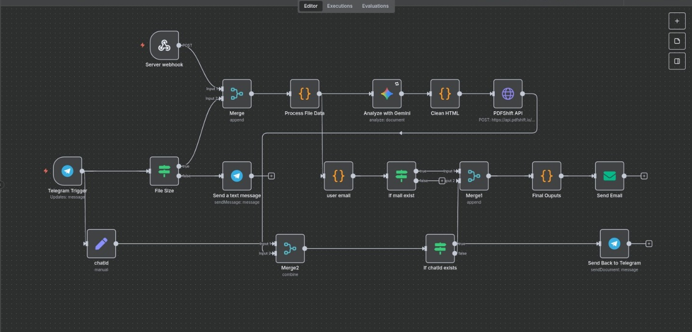

# Assignment Agent: AI-Powered Assistant

A full-stack automation system that **completes assignments on your behalf**.  
Simply upload your work (PDF, DOCX, PPTX,image) via the Web UI or Telegram. The agent processes it using Large Language Models (LLMs) and sends the completed assignment back to you via email or directly on Telegram, for quick confirmation — all with minimal manual effort.

### 🌐 Live Demo  
**Web UI:**
[**AssignAgent**](https://assignment-agent.vercel.app/)  
**Telegram Bot**
[AssignGen](https://t.me/assigngen_bot)  

> ⚠ **Note:** This project uses free-tier hosting for both the frontend and backend, so the server may experience cold starts or temporary downtime.  
If the service seems unresponsive:  
- Try again after a few minutes.  
- Or, for the best experience, **run the project locally** using the instructions in this README.  


## 🌟 What This Project Does

This project automates the process of handling assignments. It:

1.  **Accepts Submissions:** Students upload their work via a simple React frontend or through telegram.
2.  **Processes Files:** A FastAPI backend extracts text from PDFs, Word docs, and PPTs.
3.  **Runs Workflows with n8n:** n8n orchestrates the pipeline, building a clean HTML structure for answers.
4.  **Leverages AI:** LLMs (Gemini Pro) generate context-aware solutions based on assignment type.
5.  **Delivers Results:** Sends the completed assignment back to the student via email or back to telegram for review/confirmation.
6.  **Scales & Recovers:** Uses Docker for easy deployment and Supabase for reliable workflow state storage.

I built this project to deeply understand and implement cutting-edge "agentic" workflow automation using n8n, exploring how to stitch together various cloud services and APIs into a robust, functional system.

## 🛠️ Tech Stack

- **Workflow Automation:** [n8n](https://n8n.io/)
- **Backend API:** [FastAPI](https://fastapi.tiangolo.com/) (Python)
- **Frontend:** [React](https://reactjs.org/) + [Vite](https://vitejs.dev/)
- **Database:** [Supabase](https://supabase.com/) (PostgreSQL)
- **Containerization:** [Docker](https://www.docker.com/) & [Docker Compose](https://docs.docker.com/compose/)
- **LLM Provider:** Gemini Pro

## 📦 Key Components

- `/frontend` - React application for file uploads. [AI Agent frontend Repository](https://github.com/Srinanth/assignment-agent) 
- `/backend` - FastAPI server for file processing and status updates.
- `docker-compose.yml` - Defines and runs n8n and the backend service.
- `workflows/` - Exported JSON definitions of the core n8n workflows for version control.
- `.env.example` - Template for all required environment variables.

## The N8N Workflow of this project:


## Key Tools in This Project

Here’s a quick overview of the main tools that make this agent possible:

### n8n
An open-source workflow automation tool (like Zapier/Make). It lets you connect APIs and services with drag-and-drop nodes, making it easy to build complex automation without writing tons of code.


### Docker
A platform that packages apps and their dependencies into portable containers, ensuring they run the same everywhere. We use it to run the backend and n8n together reliably.


### Supabase
A hosted PostgreSQL database service. We use it to persist workflow data and application state, so the system is reliable across restarts.


## 🚀 Getting Started

### Prerequisites

Before you start, make sure you have:

* **Docker** installed: [Install Docker](https://docs.docker.com/get-docker/)
* **Docker Compose** installed: [Install Docker Compose](https://docs.docker.com/compose/install/)
* A **Supabase account** to create a PostgreSQL project: [Supabase](https://supabase.com/)
* **API keys** for Gemini (LLM), SMTP email (Gmail preferred), and Telegram Bot.

> **Tip:** Keep all API keys handy; you will need them to run the project.

### Local Development

1. **Clone the repository:**

   ```bash
   git clone https://github.com/Srinanth/AI-Agent
   cd AI-Agent
   ```

2. **Set up Environment Variables:**

   ```bash
   cp .env.example .env
   ```

   Edit the `.env` file with your actual credentials. Below are the required variables:

   | Variable               | Description                                 | Example                      |
   | :--------------------- | :------------------------------------------ | :--------------------------- |
   | `SUPABASE_DB_HOST`     | Hostname of your Supabase Postgres instance | `db.xyz.supabase.co`         |
   | `SUPABASE_DB_DATABASE` | Database name                               | `postgres`                   |
   | `SUPABASE_DB_USER`     | Database user                               | `postgres`                   |
   | `SUPABASE_DB_PASSWORD` | Database password                           | `your-super-secret-password` |
   | `Gemini_API_KEY`       | Your Gemini API key                         | `sk-...`                     |
   | `N8N_ENCRYPTION_KEY`   | Key to encrypt credentials in DB            | `random-characters-32-chars` |
   | `SMTP_*`               | Credentials for your email service provider | -                            |
   | `PDFSHIFT`             | API key for html to pdf conversion          | -                            |
   | `Telegram API`         | API key for the bot setup                   | -                            |

   > 💡 Check out the sample `.env.example` file in the repository for reference.


3. **Launch Services with Docker (Backend & n8n Only)**

    You can run the project without a frontend. The FastAPI backend provides a `/docs` endpoint that allows you to test all API endpoints directly.

    Before starting, create and activate a Python virtual environment to ensure dependencies are isolated:

    ```bash
    cd backend
    python3 -m venv venv
    source venv/bin/activate  # Linux/Mac
    venv\Scripts\activate     # Windows
    ```

    Install backend dependencies:

    ```bash
    pip install -r requirements.txt
    ```

    Start backend and n8n services using:

    ```bash
    docker-compose up -d
    ```

    Services will start at:

    * **n8n UI:** `http://localhost:5678`
    * **FastAPI Backend:** `http://localhost:8000` (visit `http://localhost:8000/docs` for interactive API testing)

    > If you want a frontend, you can set up your own React/Vite project and connect it to the backend API endpoints.
4. **Configure n8n**

    1. Open the n8n UI: `http://localhost:5678`
    2. Log in using credentials from your `.env` file.
    3. Import workflows from the `workflows/` folder.
    4. Plugin your API keys and change the workflow however you want.

5. **Test the Flow**

    * Use the `/docs` interface to upload a sample assignment or test other endpoints.
    * The agent will process it and return results via email or Telegram.

###  Troubleshooting Tips

* **Docker issues:** Ensure no other services are running on the same ports.
* **n8n errors:** Make sure the `.env` variables are correct and imported workflows match the backend setup.
* **API keys:** Invalid keys will prevent assignments from being processed.

###  Optional Enhancements

* Add a custom frontend if desired, or use FastAPI `/docs` for testing.
* Update Gemini prompts in the workflow for custom solutions.
* Test changes locally before deploying to cloud.
> You are now ready to explore Assignment Agent using only the backend and n8n, or extend it with your own frontend. Check out my frontend for reference [AI Agent frontend Repository](https://github.com/Srinanth/assignment-agent)! 

## 📋 Deployment

This system is designed to be deployed to a cloud host like Render, DigitalOcean, or an Oracle VM.

1. **Build & Push Images:** The GitHub Actions workflow (`.github/workflows/ci-cd.yml`) automatically builds Docker images and pushes them to a container registry (like Docker Hub or GHCR) when code is pushed to the `main` branch.
2. **Deploy to Host:** On your cloud host, pull the latest images and start them with `docker-compose.prod.yml`, making sure all production environment variables are set.
3. **Point to Production DB:** For production deployments, configure your n8n instance to use a live Supabase PostgreSQL database by setting the `DB_POSTGRESDB_*` environment variables correctly.

* ⚠️ **Note:** Supabase is **only required for production setups**. If you’re running everything locally, you do **not** need to configure Supabase and can use the default local setup.

4. **Cold start delays:** Free-tier hosting may take a few minutes for first requests.

## 🛡️ Security & Backups

- **Secrets:** All secrets are managed via environment variables and are never committed to the repository.
- **n8n Auth:** Basic authentication is enforced for the n8n UI.
- **Database:** Supabase provides a managed, secure PostgreSQL instance.
- **Backups:**
  - **Workflows:** The exported JSON files in `workflows/` serve as code-based backups.
  - **Database:** Supabase offers automated daily backups. For extra safety, consider a custom script to export n8n data periodically.

## 🚢 CI/CD [For future implementaion]

This project uses GitHub Actions for Continuous Integration and Deployment (CI/CD). On every push to the `main` branch, it automatically:

- Builds the Docker images for the backend and frontend.
- Runs basic tests (if defined).
- Pushes the successfully built images to a container registry, ready for deployment.

## 📄 License

This project is licensed under the MIT License.